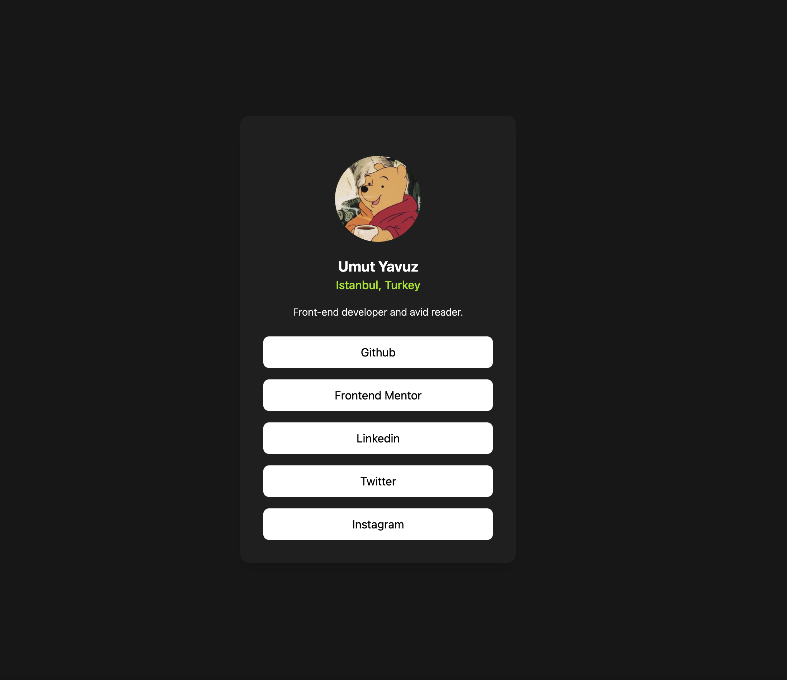

# Frontend Mentor - Social Links Profile

This is my solution to the [Social Links Profile challenge on Frontend Mentor](https://www.frontendmentor.io/challenges/social-links-profile-UG32l9m6dQ).  
It was built using **React** and **Tailwind CSS**. The goal was to create a responsive user profile card with clickable social links.

---

## 🔗 Live Site

👉 [Live preview here](https://your-live-site-link.vercel.app)

---

## 📸 Screenshot

---

## 🛠️ Technologies Used

- HTML5
- React + Vite
- Tailwind CSS
- Git & GitHub
- [Frontend Mentor](https://www.frontendmentor.io/)

---

## 💡 What I Learned

- How to use Tailwind utility classes to build a clean UI
- Flexbox and spacing with responsive design
- Managing file structure in a small project

---

## 🧩 Useful Resources

- [Tailwind Docs](https://tailwindcss.com/docs)
- [Frontend Mentor](https://www.frontendmentor.io)

---

## ✍️ Author

- GitHub: [@umutyavyz](https://github.com/umutyavyz)
- Frontend Mentor: [@umutyavyz](https://www.frontendmentor.io/profile/umutyavyz)

---

## 📜 License

This project is open source and available under the [MIT License](LICENSE).
